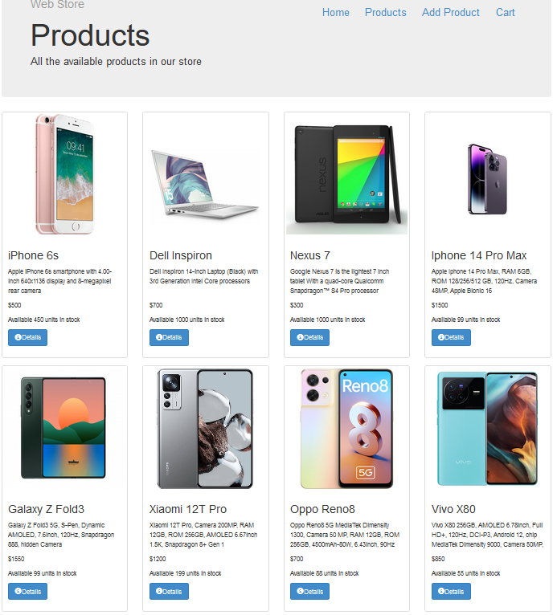
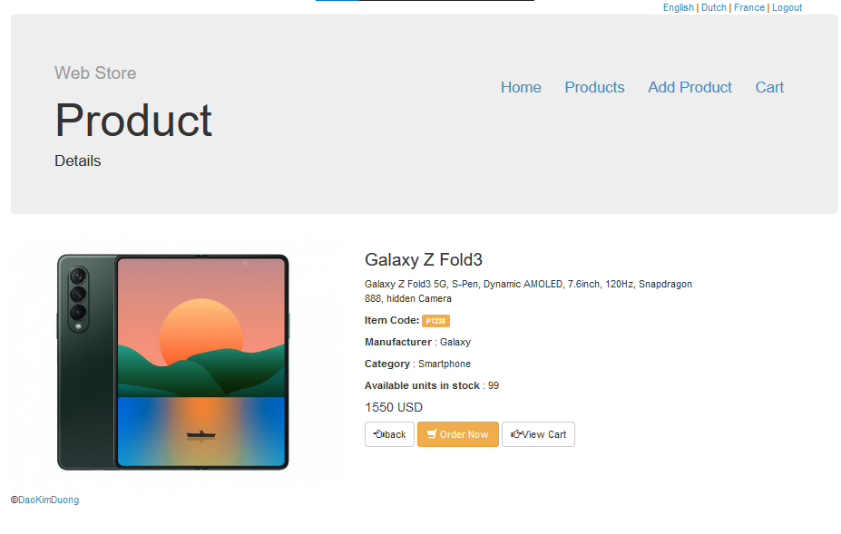
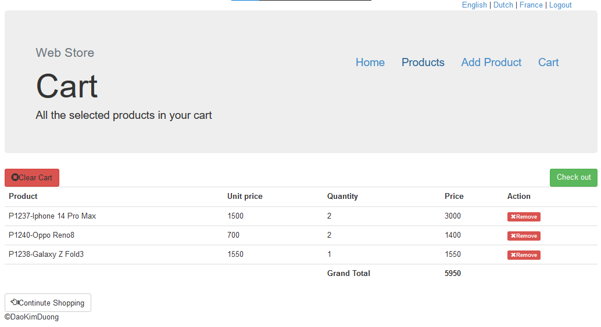
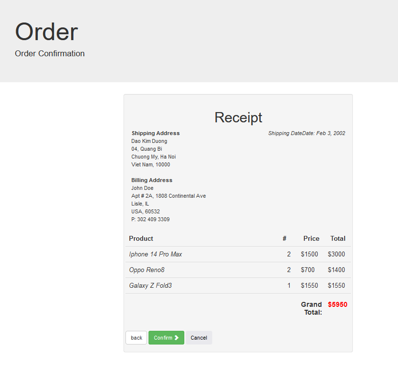
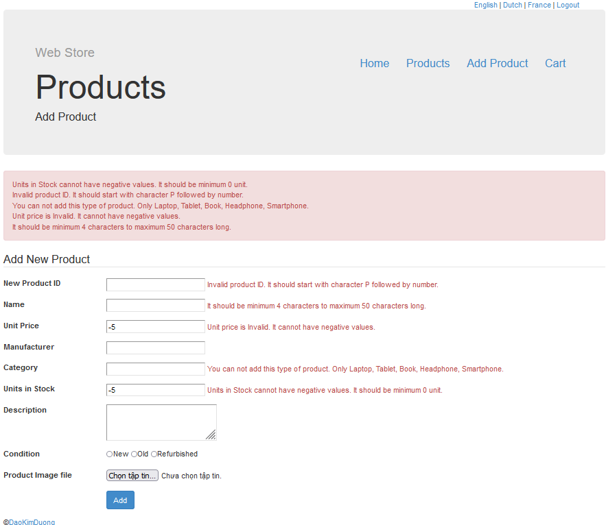

# Some image about WEBSTORE

### Home Page
In the home page, you can see all available products in store. 

### Product details
If you click on Details button of any products, you can see Product Detail page of this product.

### Cart View
Here, you can view about all selected products.

### Shipping Information Check
After you filled all information about you and reciver, you can check that information once again.

### Add new product to store
"ADMIN" only!  
Data form in each field is checked before store in database.

 
 
 
 
Happy Coding! Follow me or give me 1 star :< Plzzz;